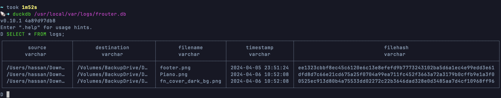

# Rust File Router

`FRouter` is a robust and efficient file routing tool developed in Rust, designed to automate the organization, hashing, and logging of files across different directories based on user-defined rules. Leveraging Rust's performance, safety, and concurrency, FRouter offers a high-performance solution to manage file systems more effectively.

```
         +-------------------+
         |   FRouter System  |
         +-------------------+
                 |
       +---------+----------+
       |                    |
+------v------+       +------v--------+
| File Watcher |      | Configuration |
+--------------+      +---------------+
       |                     |
       |                     |
       |              Reads/Reloads
       |                     |
       |              +------v------+
       |              | config.toml |
       |              +-------------+
       |
Events |
       |
+------v---------------------------------+
| Event Handler & File Processing Logic  |
+----------------------------------------+
       |                  |
       |                  | Uses
       |     +------------+-----------+
       |     |                        |
       | +---v----+             +-------v-------+
       | | SHA256 |             | File I/O      |
       | | Hash   |             | (Copy/Delete) |
       | +--------+             +---------------+
       |
       |
+------v------+
| Logging     |
| (File & DB) |
+-------------+
```

Key Components:
* File Watcher: Monitors specified directories for any changes (e.g., file additions, modifications). It triggers events based on filesystem activities.
* Configuration (config.toml): Contains the rules and settings for how files should be processed and routed. This includes target directories for different file types, whether SHA256 hashing is used, and logging preferences.
* Event Handler & File Processing Logic: Receives filesystem events from the File Watcher. It reads the configuration to determine how to process and route files (e.g., where to move files based on their extensions). It also handles file hashing to avoid duplicate processing and ensures that unique files are routed.
* SHA256 Hash: Used to compute unique hashes for files to manage duplicates effectively.
* File I/O (Copy/Delete): Performs the actual file operations, like copying files to their target directories as specified in the configuration and then deleting them from their original location if required.
* Logging (File & DB): Logs events and errors either to a file or a database, depending on the configuration settings. This includes logging file routing actions, errors encountered during processing, and system messages.
* This diagram simplifies the interactions within FRouter, focusing on the major components and their relationships. The actual implementation may involve more nuanced interactions, especially regarding error handling and configuration management.


## Features
- **Customizable File Routing**: Users can set up rules in a configuration file to automate the routing of files to specific directories based on their extensions, ensuring organized and efficient file storage.
- **SHA256 Hashing for Integrity**: Implements SHA256 hashing to ensure file integrity by checking for duplicates, guaranteeing that unique files are routed to their specified locations.
- **Comprehensive Logging**: Detailed logs for both file events and errors are maintained, supporting JSON and database logging to facilitate easy monitoring and auditing of the routing process.
- **Case-Insensitive File Extension Handling**: Treats file extensions in a case-insensitive manner, ensuring consistent routing regardless of extension case variations.
- **Dynamic Configuration**: Dynamically loads configuration files, allowing for flexible specification of routing rules and directory paths. FRouter also supports the generation of a default configuration if none is present.
- **Efficient File Processing**: Benefits from Rust's powerful IO and concurrency capabilities, making file routing both fast and safe.

## Use Cases

### Developers
Developers can utilize FRouter to automatically organize project files, binaries, logs, and datasets. For instance, you can configure FRouter to route log files to one directory for easy access and debugging, while binaries are kept in another to streamline deployment processes.

### Video Editors
Video editors can benefit significantly from FRouter by automating the organization of video clips, project files, and exports. Configure FRouter to move raw footage to dedicated storage drives and completed projects to another, ensuring an efficient workflow and optimal storage management.

### Analytics and Reporting
With the integration of DuckDB, FRouter can facilitate fast, on-the-fly analysis of log data. Developers can quickly query log databases for insights into file operations, system performance, or user activities, making it invaluable for analytics and reporting.


## Getting Started

> This app was tested on macOS.

To start using FRouter, first ensure you have the [Rust toolchain](https://www.rust-lang.org/tools/install) installed on your machine. Then, follow these steps:

```bash
git clone https://github.com/unixtime/frouter.git
cd frouter
cargo build --release
cp target/release/frouter /usr/local/bin
```

Set up your file routing rules in the config.toml file within the project root. Once configured, run FRouter using:

```bash
cargo run
```

### Configuration

The frouter creates the `TOML` configuration file under `/Users/USERNAME/.config/frouter/config.toml`

```toml
[directories]
downloads = "~/Downloads"
documents = "~/Documents"

[[extensions]]
name = "pdf"
path = "/Volumes/ExternalDrive/Documents/PDF"
enabled = true

[[extensions]]
name = "jpg"
path = "/Volumes/ExternalDrive/Images/JPG"
enabled = true
```

This configuration specifies that `PDF` and `JPG` files should be routed to separate directories under `~/Downloads`.

#### Create a startup file

`~/Library/LaunchAgents/com.DOMAIN.frouter.plist`

```xml
<?xml version="1.0" encoding="UTF-8"?>
<!DOCTYPE plist PUBLIC "-//Apple//DTD PLIST 1.0//EN" "http://www.apple.com/DTDs/PropertyList-1.0.dtd">
<plist version="1.0">
<dict>
    <key>Label</key>
    <string>com.DOMAIN.frouter</string>
    <key>ProgramArguments</key>
    <array>
        <string>/usr/local/bin/frouter</string>
    </array>
    <key>RunAtLoad</key>
    <true/>
    <key>KeepAlive</key>
    <true/>
    <key>StandardOutPath</key>
    <string>/usr/local/var/logs/logfile.log</string>
    <key>StandardErrorPath</key>
    <string>/usr/local/var/logs/error.log</string>
</dict>
</plist>
```

#### Create an alias to run and stop the `File Router`

```bash
alias run_frouter='launchctl load ~/Library/LaunchAgents/com.DOMAIN.frouter.plist'
alias stop_frouter='launchctl unload ~/Library/LaunchAgents/com.DOMAIN.frouter.plist'
```

> Note: Replace DOMAIN with whatever you like:
> Example: com.mydomain.frouter.plist

### DuckDB Query Log

- Install [DuckDB](https://duckdb.org/) with [homebrew](https://brew.sh/)
```bash
brew install duckdb
```

- Query the DB
```bash
duckdb /usr/local/var/logs/frouter.db
```


